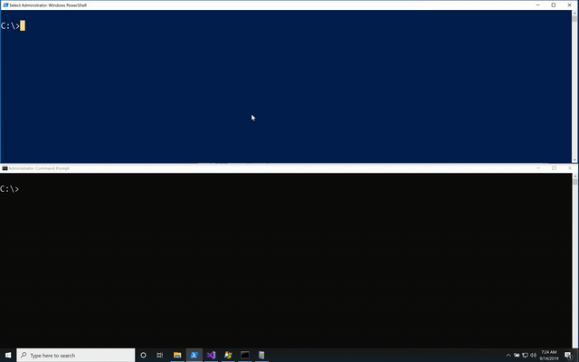

# Shhmon - Neuter Sysmon by unloading its driver
```
Usage: Shhmon.exe <hunt|kill>
```

While Sysmon's driver can be renamed at installation, it is always loaded at altitude 385201. The objective of this tool is to challenge the assumption that our defensive tools are always collecting events. Shhmon locates and unloads the driver using this strategy:

**1.** Uses `fltlib!FilterFindFirst` and `fltlib!FilterFindNext` to enumerate drivers on the system in place of crawling the registry.  
**2a.** If a driver is found at altitude 385201, it uses `kernel32!OpenProcessToken` and `advapi32!AdjustTokenPrivileges` to grant itself `SeLoadDriverPrivilege`.  
**2b.** If a driver was not found at 385201, it walks `HKLM\SYSTEM\CurrentControlSet\Services` looking for a "Sysmon Instance" subkey and if found, assigns the required permission as described above.  
**3.** If it was able get the required privilege, it calls `fltlib!FilterUnload` to unload the driver.  



## Defensive Guidance
There are a few interesting events surrounding this tactic that should be evaluated:
- **Sysmon Event ID 255** - Error message with a detail of `DriverCommunication`
- **Windows System Event ID 1** - From the source "FilterManager" stating `File System Filter '\<DriverName\>' (Version 0.0, \<Timstamp\>) unloaded successfully.`
- **Windows Security Event ID 4672** - `SeLoadDriverPrivileges` being granted to an account other than `SYSTEM`
- **Sysmon Event ID 1/Windows Security Event 4688** - Abnormal high-integrity process correlating with the driver unload. This event woudl be the last before the driver error in Sysmon

**Mitre ATT&CK References**: [T1054](https://attack.mitre.org/techniques/T1054/), [T1089](https://attack.mitre.org/techniques/T1089/)
